# 🚀 ASP.NET Core Middleware Guide

Middleware is the backbone of **ASP.NET Core / ASP.NET 8** applications. Every HTTP request and response flows through a **pipeline of middleware components**.

---

## 🔹 What is Middleware?

Middleware is software assembled into an app pipeline to process requests and responses.

👉 Think of it like **airport security checkpoints**:
- Each checkpoint (middleware) performs a task (check ID, scan bags, security check).
- Some can **stop you** (e.g., suspicious item detected).
- Others let you **pass through** to the next step.
- Finally, you reach your destination (controller/endpoint).

---

## 🔹 Built-in Middleware

ASP.NET Core comes with many **built-in middleware**, such as:

- `UseRouting()` → Finds the right endpoint.
- `UseAuthentication()` → Verifies identity.
- `UseAuthorization()` → Verifies permissions/roles.
- `UseStaticFiles()` → Serves static content like images, CSS, JS.

### Example: Online Banking App
```csharp
var builder = WebApplication.CreateBuilder(args);
var app = builder.Build();

app.UseRouting();
app.UseAuthentication(); // Built-in middleware
app.UseAuthorization();  // Built-in middleware

app.MapGet("/account", () => "Your account details here.")
   .RequireAuthorization();

app.Run();
```

✅ A guest trying `/account` will be denied or redirected until they log in.

---

## 🔹 Custom Middleware (Pass-Through Example)

Custom middleware can add behavior before/after the next middleware.

### Example: Logging Requests (E-commerce site)
```csharp
public class RequestLoggingMiddleware
{
    private readonly RequestDelegate _next;
    public RequestLoggingMiddleware(RequestDelegate next) => _next = next;

    public async Task InvokeAsync(HttpContext context)
    {
        Console.WriteLine($"➡️ Request: {context.Request.Method} {context.Request.Path}");
        await _next(context); // pass to next middleware
        Console.WriteLine($"⬅️ Response: {context.Response.StatusCode}");
    }
}

public static class RequestLoggingMiddlewareExtensions
{
    public static IApplicationBuilder UseRequestLogging(this IApplicationBuilder builder)
        => builder.UseMiddleware<RequestLoggingMiddleware>();
}
```

Register in `Program.cs`:
```csharp
app.UseRequestLogging();
```

✅ Logs every request/response in the console.

---

## 🔹 Custom Middleware (Short-Circuit Example)

Sometimes, middleware needs to **stop the pipeline** and return a response immediately.

### Example: Business Hours Restriction
```csharp
public class BusinessHoursMiddleware
{
    private readonly RequestDelegate _next;
    public BusinessHoursMiddleware(RequestDelegate next) => _next = next;

    public async Task InvokeAsync(HttpContext context)
    {
        var currentHour = DateTime.Now.Hour;

        // Allow only 9 AM - 5 PM
        if (currentHour < 9 || currentHour >= 17)
        {
            context.Response.StatusCode = StatusCodes.Status403Forbidden;
            await context.Response.WriteAsync("🚫 Service available only 9 AM - 5 PM.");
            return; // short-circuit (no next middleware)
        }

        await _next(context);
    }
}

public static class BusinessHoursMiddlewareExtensions
{
    public static IApplicationBuilder UseBusinessHours(this IApplicationBuilder builder)
        => builder.UseMiddleware<BusinessHoursMiddleware>();
}
```

Register in `Program.cs`:
```csharp
app.UseBusinessHours();
```

✅ Outside working hours → request is **blocked**.

---

## 🔹 Combining Multiple Middleware

The **order matters** in ASP.NET Core middleware.

Example: `Program.cs` pipeline

```csharp
var builder = WebApplication.CreateBuilder(args);
var app = builder.Build();

// 1️⃣ Log all requests (custom)
app.UseRequestLogging();

// 2️⃣ Restrict access to business hours (custom short-circuit)
app.UseBusinessHours();

// 3️⃣ Built-in pipeline
app.UseRouting();
app.UseAuthentication();
app.UseAuthorization();

// 4️⃣ Endpoints
app.MapGet("/", () => "✅ Welcome, site is open during business hours!");
app.MapGet("/admin", () => "🔐 Admin area").RequireAuthorization();

app.Run();
```

---

## 🔹 How the Pipeline Works

Request `/admin` → goes through:

1. **Logging middleware** → logs request.
2. **BusinessHours middleware** → blocks if outside 9–5.
3. **Routing middleware** → determines endpoint.
4. **Authentication middleware** → checks login.
5. **Authorization middleware** → checks permissions.
6. **Endpoint** → returns response.

---


---

## 🔹 Middleware Request Pipeline Diagram

Below is a simplified flow of how a request moves through the middleware pipeline:

```mermaid
flowchart TD
    A[Incoming Request] --> B[Request Logging Middleware]
    B --> C{Business Hours Middleware}
    C -->|Outside Hours| D[403 Forbidden Response 🚫]
    C -->|Within Hours| E[Routing Middleware]
    E --> F[Authentication Middleware]
    F --> G[Authorization Middleware]
    G --> H[Endpoint Execution]
    H --> I[Outgoing Response]
```


---

## 🛠 Summary

- **Built-in Middleware**: Ready-to-use features (auth, static files, routing).
- **Custom Middleware (pass-through)**: Adds behavior before/after next middleware (e.g., logging, metrics).
- **Custom Middleware (short-circuit)**: Stops pipeline early (e.g., business hours, maintenance mode, IP restriction).
- **Order Matters**: Middleware runs in the order you add them.

👉 Think of middleware as **security guards**: some just check, some record activity, and some stop you at the gate.

---
